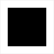

# Язык программирования Void

*
"Язык программирования не храм, а мастерская." (c)...
*

Void — это язык программирования с открытым исходным кодом,
обладающий высокой степенью расширяемости,
минималистичный и низкоуровневый в своей основе.
Void использует LLVM для генерации кода и может рассматриваться
как тонкая (ну, в каком-то смысле) оболочка вокруг него.
Расширяемость Void практически безгранична (*любой* синтаксис/семантика),
лимитирована только разрешимостью и ~~вашими деньгами~~ воображением.

## На сайте...

- [Что такое Void?](discover) ...

- [Начните сначала](learn) ...

- [Просто делайте это](use) ...

- [Копайте глубже](develop) ...

- [Сделайте это лучше](contribute) ...

